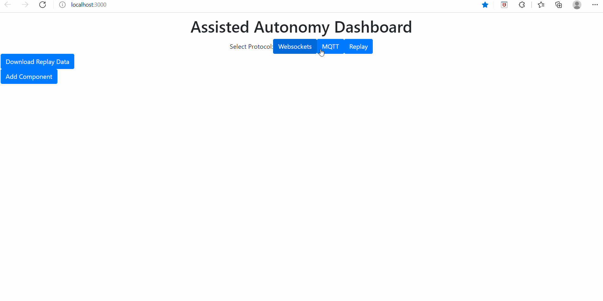

# Guide for OrigamiCarCodes.ino/Controlling the Cars

## 1. Installing the dash for controlling the car.
To control or drive a car, a _dash_ made using the React App is used and can be installed [here](https://git.uclalemur.com/arnhold/dash). The instructions on installing the dash are also in the link -- **DO NOT LAUNCH THE DASH YET or DO NOT _npm start_ yet**.

## 2. Make sure you have installed or the libraries. 
If not, go to the section [Installing needed libraries for hardware](https://git.uclalemur.com/arnhold/feedback-controlled-cars) in the README.md.

## 3. Download and Extract _OrigamiCardCodes.zip_
Then, open OrigamiCarCodes.ino

## 4. Read the guide below regarding OrigamiCarCodes.ino (Make sure to UNCOMMENT needed functionalities!)

**_UNCOMMENT_ the type of car steering that you will be using at the beginning of the code.**

```
//#define PIVOT
//#define DIFFERENTIAL 
```
The speed that you want the car to drive -- alter logically. This is the value that is being modified throughout the program (e.g, in Joystick or D-pad, PID, and etc).
```
#define SPEED 85
```
### IMU STUFFS
**_UNCOMMENT_ sensors that you will be using before uploading.**
```
#define USEIMU
//#define USELIDAR 
```

- imuDrive, rotVisualizer, and lidarDetect are variables that are set to 1 or 0 in _Command (dash Input component) and used in vehicleInstruction_ (will be discussed below in the section named _COMMUNICATION STUFFS, GUIDE FOR vehicleInstruction(char instructionType, String instrData, uint32_t from), and 5. Launch _dash_ using _npm start__)
- When imuDrive is set to 1, it allows you to use the IMU PID for staying in place or for driving straight -- the opposite if it’s set to 0.
- When rotVisualizer is set to 1, it allows you to send yaw, pitch, roll (Euler Angles) to the dash in order to use the rotation visualizer -- the opposite if it’s set to 0.
- currentAngle is used to give the car the current angle that it faces using the IMU sensor -- used for PID and other IMU stuffs (This is initialized/calibrated when imuDrive is set to 1).
- imuKp and imuKd are the components of the PID which are used for tuning the PID computations -- alter logically.
- imuError and imuPrevError are used in PID computations.
- imuPid is the PID associated with the IMU sensor
- when lidarDetect is set to 1, it allows you to use the lidar sensor of the car for front obstacle detection  -- the opposite if it’s set to 0.
- specify how far the obstacle detection is using  
```
#define FRONTOBSTACLE 100 
```

### CAMERA STUFFS
```
#define X_MIDDLE 160
#define DIST_MIDDLE 200
```
- #define X_MIDDLE 160 This is used for the either blob or april tag PID. X_MIDDLE is the midpoint distance that is used to ensure that the OpenMV camera is always directed towards the center of the object that it is detecting. If the blob is moved in a way that it is no longer in that midpoint, the car with the camera will move in order to bring the camera back to X_MIDDLE -- this is where PID is used.
- #define DIST_MIDDLE 200 This is the same as X_MIDDLE but in the z-direction of the camera instead of the x-direction. The car will move either forward, backward, or stop to satisfy this midpoint distance -- this is here PID is used.
- lookForblob is a variable that is set to 1 or 0 in Command (dash Input component) and used in vehicleInstruction (will be discussed below in the section named _COMMUNICATION STUFFS, GUIDE FOR vehicleInstruction(char instructionType, String instrData, uint32_t from), and 5. Launch _dash_ using _npm start__)
- When lookForblob is set to 1, it enables the color detecting function of the car with an OpenMV camera -- the opposite if it’s set to 0.
- all other variables: rotKp, rotKd, and the have similar functions to their IMU PID counterparts above in the section called IMU Stuffs.

### EXTERNAL CAMERA + MICROCONTROLLER
...

### COMMUNICATION STUFFS
go to https://git.uclalemur.com/arnhold/espmeshnetworking/-/tree/master/MeshCode for documentation
- interpretDashInstructions(String& msg)
- vehicleInstruction(char instructionType, String instrData, uint32_t from)
- receivedCallback(uint32_t from, String &msg)
- mqttCallback(char* topic, uint8_t* payload, unsigned int length)
- newConnectionCallback(uint32_t nodeId)

### GUIDE FOR vehicleInstruction(char instructionType, String instrData, uint32_t from)
When a string is inputted in Command (dash Input component -- see #2 in section Launch _dash_ using _npm start_ below), it will either do one of the following actions in https://git.uclalemur.com/arnhold/espmeshnetworking/-/tree/master/MeshCode in the section _Using the Dash with the Network_ OR it will go to _vehicleInstruction_ which will parse instrData and execute the respective action depending on the first character of instrData. 

### GUIDE FOR DEBUGGING USING ADAFRUIT NEOPIXEL FEATHERWING
Certain LEDs in the featherwing will light up in a specific color depending on the functionalities enabled using the dash. The full guide for which LED lights up , what color lights up, and what functionalitiy is enabled is seen on the table at the end of this README.

_Numbers in red are LEDs used for debugging _OrigamiCardCodes.ino_ -- green = not used._


## 5. Launch _dash_ using _npm start_.
Or see guide [here](https://git.uclalemur.com/arnhold/dash).


<!-- blank line -->

**The gif above is the visual presentation of the instructions below**

1. _OrigamiCardCodes.ino_ uses MQTT. Thus, click the MQTT button in the dash. Then, make the Port to 8080.
2. The main components used are (For a description of dash components go [here](https://git.uclalemur.com/arnhold/dash/-/tree/master/dash-react-app) and read the section _Adding Components_)
<!-- blank line -->
Note: Topics = named
- a Scrolling Text named "Debug"
- a Mesh Topology named "Mesh"
- an Input named "Command"
- a Joystick or D-Pad named "MasterJoystick" (A D-pad is easier to use on both differential and pivot steering cars)
- ONLY WHEN ENABLED: a Rotation Visualizer named "Rot"
3. If not yet done, upload _OrigamiCarCodes.ino_ to the car (MAKE SURE YOU READ THE SECTION #4 GUIDE ABOVE!)
4. Once LED 0 of the neopixel featherwing turned green, a number will appear in the "Mesh" Mesh Topology Component. If LED 0 is green and a number didn't appear, type 'G' in the "Command" Input Component. A number will appear at the "Debug" Scrolling Text Component. Copy this number and paste it in the "Mesh" Mesh Topology Component. The number is the nodeID of the car/microcontroler.
5. Once the nodeID is in the "Mesh" Mesh Topology Component. You will see it on the "Select Target Nodes:" of the other components. Click the nodeID of your car to control it using an Input, Joystick, or D-pad. See the section _Using the Dash with the Network_ [here](https://git.uclalemur.com/arnhold/espmeshnetworking/-/tree/master/MeshCode) for a more detailed explanation -- you can also find the instructions for using multiple cars or controlling a car with another microcontroller in this section.

**From here, the car can be controlled using a Joystick/D-pad by a user/you. To enable certain functionalities using other Components see the guide below.**

### Summary Guide Table for Controlling Car using _OrigamiCarCodes.ino_ + DEBUGGING USING LED

The table is the summary of the strings or char that can be sent to "Command" (or a component from the dash) and that can be executed by vehicleInstruction + the guide for debugging using the Adafruit Neopixel Featherwing.


<!-- blank line -->

**The gif above is an example of how the strings can be inputted in "Command"**


